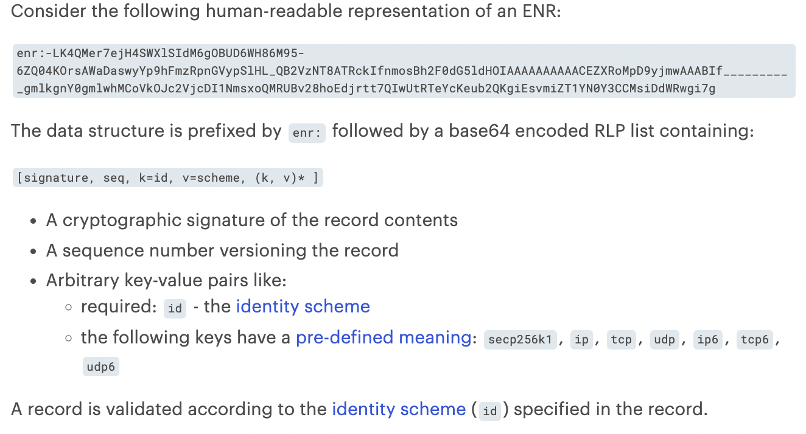

# Notes

This repos contains my notes about my research on network protocols on Ethereum.

## Networking Layer

<https://ethereum.org/en/developers/docs/networking-layer/>

The networking layer consists of protocols that allow nodes to find each other and exchange information. There are 2 ways of communicating with other nodes: gossip (one-to-many) and request and response (one-to-one).

Each client (execution client and consensus client) has its own distinct networking stack. Execution clients gossip (one-to-many) transactions with other authenticated execution peers. Consensus clients gossip Beacon blocks accros their p2p network. This means there are two p2p networks:

- one network connecting execution clients for transaction gossip
- one network connecting consensus clients for block gossip

### The Execution Layer

There are 2 stacks for this layer:

- **Discovery**: built on top of UDP. Allows a new node to find other peers
- **DevP2P**: build on top of TCP. Allows nodes to exchange information

#### Discovery (discv5)

<https://github.com/ethereum/devp2p/blob/master/discv5/discv5.md>

When a new node joins the network, first it will contact the bootstrap nodes (hardcoded in the client implementation). The bootstrap nodes are only used when the node joins the network for the first time. After that, the node will no longer talk to them.

The protocol uses a modified form of Kademlia.

> Discovery starts with a game of PING-PONG. A successful PING-PONG "bonds" the new node to a bootnode. The initial message that alerts a bootnode to the existence of a new node entering the network is a PING. This PING includes hashed information about the new node, the bootnode and an expiry time-stamp. The bootnode receives the PING and returns a PONG containing the PING hash. If the PING and PONG hashes match then the connection between the new node and bootnode is verified and they are said to have `bonded`.
>
> Once bonded, the new node can send a FIND-NEIGHBOURS request to the bootnode. The data returned by the bootnode includes a list of peers that the new node can connect to. If the nodes are not bonded, the FIND-NEIGHBOURS request will fail, so the new node will not be able to enter the network.
>
> Once the new node receives a list of neightbours from the bootnode, it begins a PING-PONG exchange with each of them. Successful PING-PONG bond the new node with its neighbours, enabling message exchange.

```lang-none
start client --> connect to bootnode --> bond to bootnode --> find neighbours --> bond to neighbours
```

##### dht

<https://en.wikipedia.org/wiki/Distributed_hash_table>
<https://vac.dev/kademlia-to-discv5>

> The main advantage of a DHT is that nodes can be added or removed with minimum work around re-distributing keys. Keys are unique identifiers which map to particular values, which in turn can be anything, from addresses, to documents, to arbitrary data. Resposibility for maintaining the mapping from keys to values is distributed among the nodes, is such a way that a change in the set of participants causes a minimal amount of disruption. This allows a dht to scale to extremely large number of nodes and to handle continual node arrivals, departure, and failues.
>
> A distributed hash table (DHT) is essentially a distributed key-value list. Nodes participating in the DHT can easily retrieve the value for a key.
>
> If we have a network with 9 key-value pairs and 3 nodes, ideally each node would store 3 (optimally 6 for redundancy) of those key-value pairs, meaning that if a key-value pair were to be updated, only part of the network would responsible for ensuring that it is. The idea is that any node in the network would know where to find the specific key-value pair it is looking for based on how things are distributed amongst the nodes.

##### Kademlia

<https://medium.com/coinmonks/a-brief-overview-of-kademlia-and-its-use-in-various-decentralized-platforms-da08a7f72b8f>

> Kademlia is a dht that provides a way for nodes to self-organize into a network and share resources between computers.
>
> On Kademlia each node has the mapping for a subset of the nodes on its own routing table.  This routing table is distributed among the nodes.

By having this distribute routes table, this allows the network to be resistant to dos attacks and loss of a group of nodes.

Kademlia defines the distance beween points in the key space by using the XOR. The distance between nodes is not the geographcial distance but instead the XOR of the id.

> For a network with 10,000,000 Kademlia nodes, only about 20 hops would be necessary at most for communication with any subset of nodes.


Kademlia prefers long-lived nodes over newer entrants.


> The process of joining a Kademlia network requires the discovery of only one peer, whereby the node then broadcasts its appearance. The node that recently joined the network then collects the NodeId from each response and adds it to its own dht.

Kademlia NodeId usually have 160 bits. The distance between 2 nodes is the XOR of the NodeIds.

> The structure of the Kademlia routing table is such that nodes maintain detailed knowledge of the address space close to them and exponentially decreasing knowledge of more distance address space.
>
> **K-buckets** are a list of routing addresses of other nodes in the network, which are maintained by each node and contains the IP address, port and NodeId for peer participants in the system. They prefer the longest-lived nodes, which means that one cannot overtake a node's routing state by flooding the system with new nodes (thus preventing certain types of ddos attacks).
>
> Kademlia requires that peers speak the same language so that they may find each other, recognize one another's position, and exchange messages.

The Kademlia protocol consists of four Remote Procedure Calls (RPCs):

- PING: Probes a node to see if it's online
- STORE: Instructs a node to store a key-value pair
- FIND_NODE: Returns information about the *k* closest to the target id
- FIND_VALUE: Similar to the FIND_NODE RPC, but if the recipient has received a STORE for a given key, it just returns the stored value

> Ethereum uses a slightly modified implementation of Kademlia. Ethereum utilizes the Kademlia's XOR metric and the k-bucket struct, and the lookup is mostly used to discover new peers.
> In Ethereum, the client stores information about other nodes in two data structures. The first is a long-term database, called db, which is stored on disk and persists across client reboots. The second is a short-term database, called table, which contains Kademlia-like buckets which are always empty whenever the client reboots.

#### Ethereum Node Records (ENR)

<https://ethereum.org/en/developers/docs/networking-layer/#enr>
<https://ethereum.org/en/developers/docs/networking-layer/network-addresses/>
<https://github.com/ethereum/devp2p/blob/master/enr.md>
<https://dean.eigenmann.me/blog/2020/01/21/network-addresses-in-ethereum/>
<https://eips.ethereum.org/EIPS/eip-778>
<https://consensys.net/diligence/blog/2020/09/libp2p-multiaddr-enode-enr/>

> The Ethereum Node Record is an object that contains three basic elements: a signature (hash of record contents made according to some agreed identity scheme), a sequence number that tracks changes to the record, and an arbitrary list of key:value pairs. This is a future-proof format that allows easier exchange of identifying information between new peers and is the preferred network address format for Ethereum nodes.
>
> A node record usually contains the network endpoints of a node: the node's IP addresses and ports. Node record also contains information about the node's purpose on the network.
>
> Ethereum nodes have to identify themselves with some basic information to connect to peers. To ensure any potential peer can interpret this information, it is relayed in one of three standardized formats that any Ethereum node can understand: multiaddr, enode, or Ethereum Node Records (ENRs). ENRs are the current standard for Ethereum network addresses.

ENR motivation was to allow for more information to be relayed. ENR came after the multiaddr and enode network addresses and was introduced on [EIP-778](https://eips.ethereum.org/EIPS/eip-778).

This record contains a signature, a sequence number and a key value pair.

> The signature is used to verify the record by ensuring that the passed public key was the one used to create the signature.
>
> The sequence number can be used to resolve conflicts, if there are 2 different records authored by the same identity, the one with larger sequence number must be used.
>
> This format is future proof as new keys can be added even when not all clients know how to interpret there, as well as the fact that new identity schemes can be added to validate signatures.
>
> ENR’s are specific to the Ethereum network and used by a node to share information about itself. For example, a node can pack arbitrary key-value pairs along with a sequence number into a record and sign it. When ENR information is relayed in the P2P network, each node can verify the authenticity of the record. The record’s sequence number allows peers to detect that their cached record is outdated. Peers can also passively learn from relayed ENRs about other nodes in the network and decide if they want to peer with them. Ideally, the node record would include more information like the purpose of a node on the network, e.g. what network they’re on, their last head, etc.


*<https://consensys.net/diligence/blog/2020/09/libp2p-multiaddr-enode-enr/>*

### devp2p

<https://ethereum.org/en/developers/docs/networking-layer/#devp2p>
[This repos](https://github.com/ethereum/devp2p) contains the specifications for devp2p

> devp2p is itself a whole stack of protocols that Ethereum implements to establish and maintain the peer-to-peer network. After new nodes enter the network, their interactions are governed by protocols in the devp2p stack. These all sit on top of **TCP** and include the *RLPx transport protocol, wire protocol and several subprotocols*.
>
> **RLPx is the protocol governing initiating, authenticating and maintaining sessions between nodes**. RLPx encodes messages using RLP which is a very space-efficient method of encoding data into a minimal structure for sending between nodes.
>
> A RLPx session between two nodes begins with an initial cryptographic handshake. This envolves the node sending an auth message which is then verified by the peer. On successful verification, the peer generates an auth-acknowledgement message to return to the initiator node. This is a *key-exchange process* that enables the node to communicate privately and securely. A successful cryptographic handshake then triggers both nodes to send a *"hello"* message to one another "on the wire". The wire protocol is initiated by a successful exchange of hello messages.

#### Sub-protocols

- Wire protocol
  - Once peers are connected, and an RLPx session has been started, the wire protocol defines how peers communicate. The wire protocol is responsible to define the transaction exchange between nodes. Since Ethereum has switched to pos, block propagation and chain synchronization have become part of the consensus layer.
- les (light ethereum subprotocol)
  - Minimal protocol for syncing light clients.
- Snap
  - It's an optional extension that allows peers to exchange snapshots of recent states, allowing peers to verify account and storage data without having to download intermediate Merkle trie nodes.

### The Consensus Layer

<https://ethereum.org/en/developers/docs/networking-layer/#consensus-layer>

> The consensus clients participate in a separate peer-to-peer network with a different specification. Consensus clients need to participate in block gossip so that they can receive new blocks from peers and broadcast them when it is their turn to be block proposer. Similar to the execution layer, this first requires a discovery protocol so that a node can find peers and establish a secure session for exchanging blocks, attestations etc.

#### Discovery

<https://ethereum.org/en/developers/docs/networking-layer/#consensus-discovery>

> Similar to the execution clients, consensus clients use discv5 over udp for finding peers.
>
> The execution layer's RLPx sessions are deprecated in favour of libp2p's noise secure channel handshake.

#### libp2p

<https://ethereum.org/en/developers/docs/networking-layer/#libp2p>

> The libp2p stack supports all communications after discovery. Clients can dial and listen on ipv4 and/or ipv6 as defined in their enr.

### Connecting the execution and consensus clients

<https://ethereum.org/en/developers/docs/networking-layer/#connecting-clients>

> Both consensus and execution clients run in parallel. They need to be connected so that the consensus client can provide instructions to the execution client, and the execution client can pass bundles of transactions to the consensus client to include in Beacon blocks. The communication between the two clients can be achieved using a local RPC connection.
